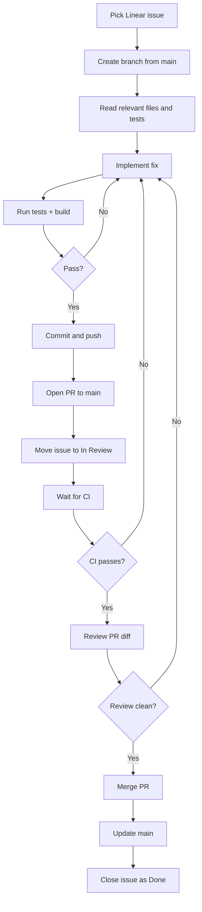

# Agent-Driven Development Loop

This project is a lightweight version of a real software delivery loop: an issue enters the system, the agent pulls the right context, implements the fix, verifies it, and only then moves the work forward through GitHub and Linear. The loop is intentionally simple, but it reflects the same pattern you would use in a production workflow with multiple agents and MCP tools.

## Loop overview



## How the loop runs end to end

1. Start from a Linear issue.
2. Create a feature or improvement branch from the latest main branch.
3. Read only the relevant parts of the codebase, especially the files tied to the current task and the matching tests.
4. Implement the change in the smallest useful scope.
5. Run the project checks (tests and build) immediately.
6. If checks fail, loop back to the fix step until the change is green.
7. When validation passes, commit with the issue key in the message and push the branch.
8. Open a pull request against main and move the issue into review.
9. Let CI do the first gate. If CI fails, fix the branch and re-run validation.
10. Review the actual PR diff and check for correctness and regressions.
11. If review finds issues, patch them and repeat the validation cycle.
12. When CI is green and the review is clean, merge to main.
13. Pull the merged result back to main and mark the issue as Done.

This is the core loop: issue -> context -> implementation -> validation -> merge -> close.

## Agents and MCP servers used

### Agent

The orchestration layer was Claude Code, but running through the open-source/free Claude Code flow rather than a paid hosted setup. In practice, the agent was acting as the operator: it decided what to read, what to change, and when to stop for validation.

### MCP servers

The loop used two MCP integrations:

- Linear MCP: for issue selection, status changes, and tracking work through the workflow.
- GitHub MCP: for repository access, branch operations, PR creation, review, and merge status.

The pattern was straightforward:

- Linear owned the work state.
- GitHub owned the code state.
- The agent owned the decision-making loop.
- Local Git commands remained the source of truth for commit, push, and branch work.

## How to connect your MCP server to Codex and Claude Code

The important idea is not the tool vendor; it is the same pattern in both agents: register the MCP server in the client config and let the agent discover it as a tool source.

### Pattern

Use a config block similar to this for your MCP server:

```json
{
  "mcpServers": {
    "linear": {
      "command": "node",
      "args": ["/path/to/your/mcp-server-linear/index.js"],
      "env": {
        "LINEAR_API_KEY": "YOUR_LINEAR_TOKEN"
      }
    },
    "github": {
      "command": "npx",
      "args": ["-y", "@modelcontextprotocol/server-github"],
      "env": {
        "GITHUB_TOKEN": "YOUR_GITHUB_TOKEN"
      }
    }
  }
}
```

Then in the agent client:

- Add the MCP server definitions to the user or project config for that agent.
- Restart or reload the session.
- Verify the tools appear in the tool list.
- Start with one small issue and confirm the agent can read the issue, create a branch, and push changes.

For Codex, the pattern is the same: the agent must be configured to load the installed MCP servers and expose their tools. For Claude Code, the same principle applies: your server is available to the session once it is registered in the client config and the session picks it up.

You do not need to build the entire workflow into the server. The server should only expose the operations the agent needs: issue lookup, status updates, repo actions, and PR context. The loop logic lives in the agent.

## What I would do next with more time

The biggest improvement I would make is to increase the effective context window of Claude sessions without depending on a bigger model alone.

The practical approach would be:

- Keep a rolling project summary instead of dumping the full transcript every time.
- Store compact memory for each session: current goal, files touched, decisions made, blockers, and validation status.
- Summarize long PR or issue threads into a short status snapshot before the next agent pass.
- Reuse a structured brief at the start of each loop so the agent starts from the latest state instead of rebuilding context from scratch.
- Add a lightweight memory layer that keeps the current branch, issue, and test status in one place.

In short, the next step would be “context compression,” not just “larger context.” The agent should begin each cycle with a clean, condensed state summary so it can reason over the actual task, not over stale conversation history.

## Summary

This workflow works because it treats the agent as a disciplined operator inside a controlled loop:

- the issue defines the task,
- the code defines the change,
- validation proves the change,
- GitHub moves the patch forward,
- Linear keeps the outcome visible.

That combination creates a reliable end-to-end development loop without losing the human review and release gates.
