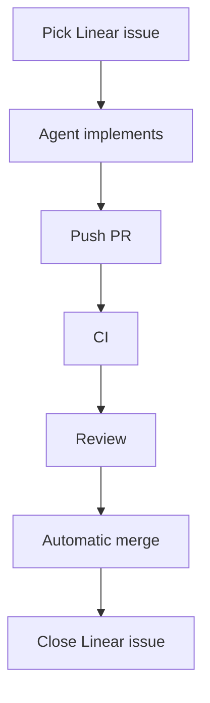

# Agent-Driven Todo

A deliberately small React + TypeScript Todo app built to demonstrate an
agent-driven software development loop.



## LOOP Running Video URL

```
https://drive.google.com/file/d/133L8LPwJaNl3moKErI7XneXs9dCFMYPb/view?usp=sharing
```

## What I used

- **Coding agent:** Claude Code
- **Project tracking:** Linear MCP
- **Repository and pull requests:** GitHub MCP and local Git
- **Application:** React, TypeScript, and Vite
- **Tests:** Vitest and Testing Library
- **CI:** GitHub Actions for app tests, MCP tests, MCP typecheck, and build
- **Remote MCP:** Cloudflare Workers with the current Agents SDK
- **MCP API:** `createMcpHandler` from `agents/mcp/server`, `McpServer` v2,
  Zod, Streamable HTTP, and GitHub’s public REST API

The loop was exercised from ticket selection through code changes, CI,
review, and automatic PR merge. The current app supports adding and
completing Todo items.

I would next implement Todo persistence and a delete action. Development was
slowed by the rate limits of Claude's free tier, so I will continue working
on these improvements after submission.

## Connect to the MCP

**Demo endpoint:**
`https://mcp.hammadsarwar2200.workers.dev/mcp`

Health check: `https://mcp.hammadsarwar2200.workers.dev/health`

This is a public, unauthenticated, read-only MCP.

Claude Code and Codex can use this HTTP MCP configuration:

```json
{
  "mcpServers": {
    "agent-driven-todo": {
      "type": "http",
      "url": "https://mcp.hammadsarwar2200.workers.dev/mcp"
    }
  }
}
```

Example questions:

- “Where is Todo state stored?”
- “What does the completion handler do?”
- “Which tests cover adding a Todo?”

## MCP tools

`project_info`, `list_files`, `read_file`, `search_code`,
`get_file_metadata`, `list_tests`, `list_ci_workflows`, `read_ci_workflow`,
and `get_repository_structure`.
